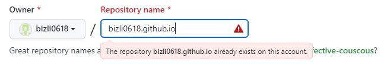

# Why Github Blog?

---

2022년 늦가을, 할 일이 분명히 있겠지만 그것을 싹 잊어버린 블로그 주인장은 4시간 동안 할 일을 찾아 나선다. 기록의 민족 한국인이지만 무계획의 극치를 달리고 있는 상태에서 급박하게 찾은 일은? **!블로그 만들기!**

네이버 등등의 블로그는 템플릿을 정하고 거기에 글을 쓰는 방식인데, 그거 말고 진짜 흰 바탕에서 내 블로그를 시작해보고 싶었고, 개발자들이 간지나는 깃헙 블로그가 있는게 부러워서 깃헙 블로그를 만들게 되었다!

# Well, Let’s Start!

---

큰 틀은 다음의 블로그를 참고하였다.

[https://supermemi.tistory.com/144](https://supermemi.tistory.com/144)

이 블로그에서는 터미널을 적극 사용하였지만 이 게시글에서는 github desktop을 활용해보자.

개인적으로 시도해 본 방법이니 ‘왜 저렇게 하지?’ ‘뭐지?’ 라는 생각이 들어도 어쩔 수 없다.

## 1. New Repository

*[깃헙아이디.github.io](http://깃헙아이디.github.io) 로* 레포지터리를 만든다.

이미 깃헙 레포를 만든 상황에서 다시 재현하려니까 보기 싫은 경고문이 뜬다. 하지만 여러분은 초록색 이름이 뜰 것이다.

Description 에는 아무 것도 안 적어도 된다.

블로그니까? Public으로 한다. (? Private로 했을 때는 아예 블로그가 만들어지지 않나? 나만 볼 수 있는 블로그가 만들어지나? 나중에 시간나면 해봄 <<결과 적기 필수)

README file도 만들어준다. 나머지는 건들지 않고, **Create repository**를 누른다.

‘

썰렁하네요!

## 2. Clone Repository

여기서부터가 참고했던 글과는 조금 달라지는 부분이다. 이미 깃허브 데스크톱이 있기 때문에, **Open with GitHub Desktop**을 선택한다. 

중간에 레포지토리를 clone하는 설정창이 뜰 수도 있다. 캡처를 까먹음..

## 3. index.html 생성

위의 그림에서 Open in Visual Studio Code로 들어간다. 물론, 터미널에서 적어도 된다! 그냥 새로운 방법으로 해보고 싶었다. 다음의 모든 과정은 Visual Studio Code가 이미 Github과 연동 되어 있을 때 가능하다.

“새 파일” 버튼을 누르고

다음과 같이 제목은 index.html, 내용은 “Hello World!”로 적어준다. ctrl+s로 저장을 해주면 다음과 같이 왼쪽 세번째 아이콘에 ①이 뜬다.

## 4. Commit, Push!

엥? 뭐야 바로 커밋해야지

적당히 커밋 메시지를 적고, 커밋버튼을 누른다.

변경 내용 동기화(push)를 한다. 

흠. 너무 오래 걸리는데… 간단한 파일 하나도 이리 오래 걸리니, 다시 깃헙 데스크톱으로 돌아가보자.

<aside>
💡 (+ 알고보니 깃헙 연동을 다시 해야 했었다. autorize 해주니까 로딩 풀림)

</aside>

Push origin을 눌러준다. 위의 바에서 누르든 아래 파란색 버튼을 누르든 상관 없다.

주소에 [https://깃헙아이디.github.io](https://깃헙아이디.github.io를) 를 치면?

새로고침이 필요할 수도 있다. 하지만! 됐다!